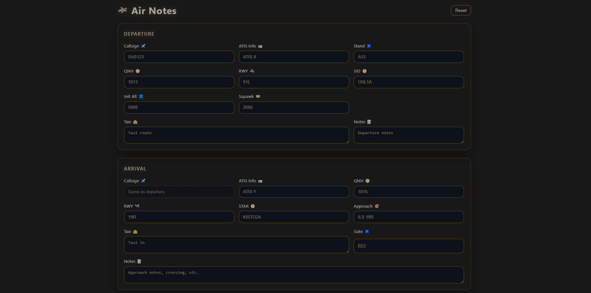

AirNotes
=========

Fast, simple flight notes for virtual pilots. The app runs entirely in the browser and stores your data locally via localStorage, so your notes persist between sessions.
Test it out here: https://its-syntax.github.io/Air-notes/

Contents
- Overview
- Features
- Tech & Requirements
- Data & Privacy
- Changelog
- License

Overview
- Lightweight form for Departure and Arrival.
- Auto‑save as you type (localStorage).
- One‑click Reset to clear all fields.
- Minimalistic UI focused on readability and speed.

Features
- Fields for callsign, ATIS, QNH, RWY, SID/STAR, approach, taxi, and notes.
- No server, no accounts — everything stays in your browser.

Tech & Requirements
- Vue 3 (Composition API)
- Vite 7
- Node.js 20.x or newer (see engines in package.json)

Data & Privacy
- Storage: localStorage under the key air-notes:v1
- No external requests or server storage. Everything runs locally in the browser.
- Clear data: use the Reset button in the UI, or remove the localStorage key via devtools.

Changelog
- 0.1.0 - 2025-10-23
  - Initial release
  - Lightweight form for Departure and Arrival
  - Auto-save to localStorage as you type
  - One-click Reset to clear all fields
  - Minimal UI focused on readability and speed

License
- Copyright (c) 2025 AirNotes contributors. All rights reserved.
